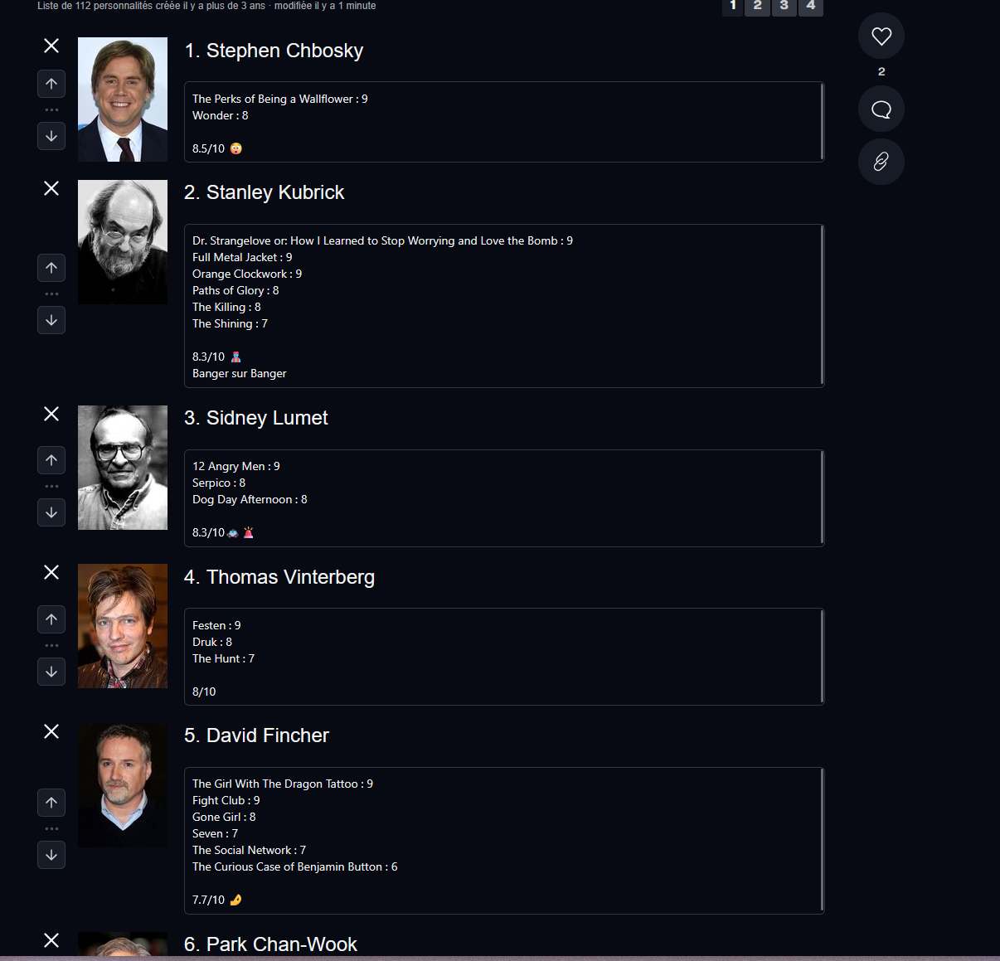

- [X] Artworks on people's films etc
- [X] Music artists pages: separate albums, EPs, singles, live releases, etc.
- [X] Collections: separate mainline, spin-offs, etc. inside collections
- [X] Last.fm statistics integration
- [X] Pitchfork lists: selected Best Albums of the 2000s snapshot
- [X] Lists like 1001 Albums or Movies Before You Die
- [X] Rolling Stone 500 Greatest Albums: selected snapshot
- [X] Clickable artist on an album page
- [ ] Where to watch (platforms, in spain) on movies and tv shows
- [ ] Improve the music calendar view: artist links are added, but the calendar still needs a richer RateYourMusic-style layout and investigation of missing releases]
- [ ] More last.fm (On album pages, artists pages, more stats on the stats page)
- [ ] new york times best 100 tv shows of 21st century
- [ ] nyt best 100 movies
- [ ] 35 dogme 95 movies
- [ ] robert festival
- [ ] more local festival etc
- [ ] cannes palme d'ors
- [ ] cannes prix du jury
- [ ] etc just more more lists and complete them
- [X] Collections : Franchise timeline is nice but pictures are not all the same size, it looks weird (cards forced to fixed size + images absolutely filled; needs rebuild + visual check)
- [ ] Any way to get faster stats ? (Preload them weekly or something ? any method?)
- [X] director / music artists / actor rankings similar to this :(This one is a manual list, but i want a automatic list, at least 3 rated) (added "Best Rated People" card on stats > people tab, avg score, min 3 rated, no cap: full ranking with show top 10 / show all toggle, expandable film scores; Top People card also uncapped (min 3 appearances, show top 10 / show all); needs rebuild)
- [ ] 
